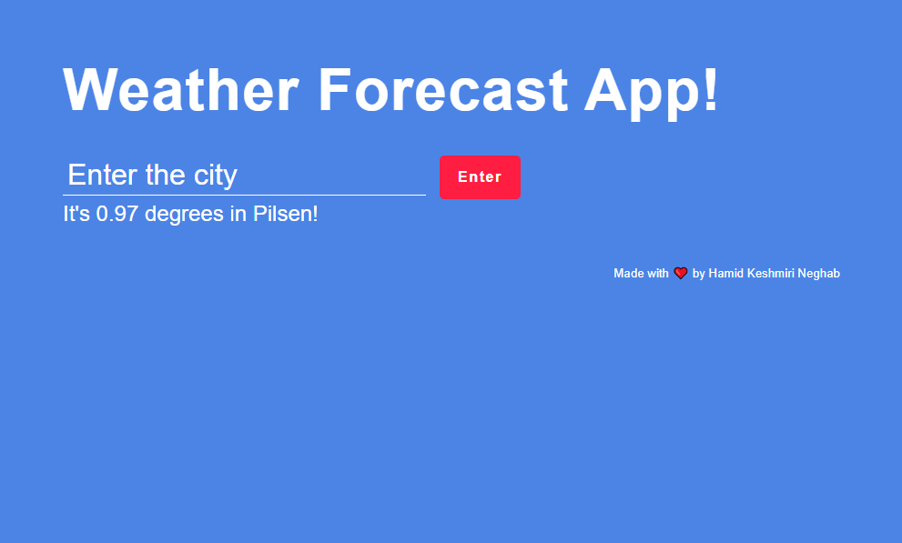

# Build a weather forecast application based on Express.js using API

```npm init```

```npm install express```

```npm install body-parser```

```npm install request```

```npm install unirest```

```nodemon server.js```

